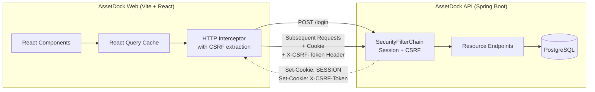

<br/>
<div align="center">
<h1 align="center">AssetDock Web</h1>
<p align="center">
A serious, B2B-style React application for managing IT assets, users, and audit logs.
</p>
<p align="center">
  <a href="https://react.dev/"></a>
  <a href="https://www.typescriptlang.org/"></a>
  <a href="https://vitejs.dev/"></a>
  <a href="https://tailwindcss.com/"></a>
  <a href="https://playwright.dev/"></a>
</p>
</div>

<br/>

## Overview

AssetDock Web is the companion frontend for the [`assetdock-api`](https://github.com/nicokaka/assetdock-api) backend service. It provides a cohesive, authenticated workspace to track organizational inventory, track user lifecycles, assign devices, parse bulk CSV imports, and inspect chronological system activity.

Designed specifically for organizational administrators, the UI explicitly completely rejects buzzwords and gamification. Instead, it relies on a sober, content-first layout built with Tailwind CSS 4, utilizing deep native system colors and high-density information displays.

## Architecture & Flows

The architecture bridges the stateless React application with the stateful Spring Boot backend utilizing standard web security practices (Cookie-based Sessions and Anti-CSRF Tokens).



## Features Complete (MVP)

1. **Authentication Foundation**: Full cookie-based session guarding and automatic token attachment via Vite Axios/Fetch wrapper.
2. **Asset Management**: Complete CRUD operations, lifecycle state machine tracking (`IN_STOCK`, `RETIRED`, `LOST`), and detailed views.
3. **Identity Operations**: User listings, detailed active profiles, role elevation flows, and integrated asset assignment histories.
4. **Assignments**: Checking out and checking in assets directly from the asset detail interface, tracked chronologically.
5. **CSV Imports**: Drag-and-drop ingestion of bulk asset sheets tracking progress against system import jobs.
6. **Audit Interface**: Operational read-only view of the central `audit_logs` table for tracking high-privilege state changes.

## Areas & Previews

* **Home & Overview (Dashboard)**
* **Assets Table & Detail**
* **User Management & Editing**
* **Audit Logs Viewer**
* **CSV Imports Module**

## Getting Started

### 1. Requirements

- Node.js 22 (enforced via `.node-version`)
- A running instance of `assetdock-api` on `localhost:8080` (or update the proxy target in `vite.config.ts`).

### 2. Setup & Run

```bash
# Clone the repository
git clone https://github.com/nicokaka/assetdock-web.git

# Install dependencies (React 19, Tailwind 4, React Query v5)
npm install

# Start the Vite development server (automatically proxies /api to port 8080)
npm run dev
```

Visit `http://localhost:5173` to access the AssetDock welcome screen.

## Testing

The frontend incorporates a suite of strict Playwright End-to-End smoke tests simulating a complete administrative user journey. To run the tests (requires the API to be operational locally):

```bash
# Install Playwright browser binaries (First time only)
npx playwright install --with-deps

# Run the E2E suite
npm run e2e
```

## Tooling Commands

* `npm run build`: Type-checks (`tsc`) and bundles for production via Vite.
* `npm run lint`: Checks conventions through ESLint and Prettier integrated configurations.

---

*This application forms the visual layer of the completed AssetDock MVP architecture.*
